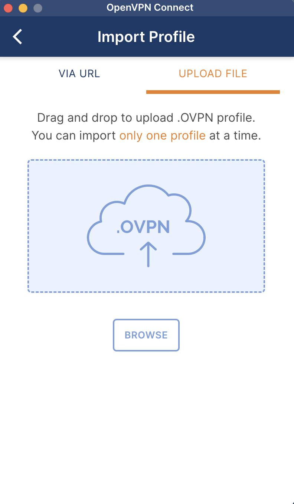
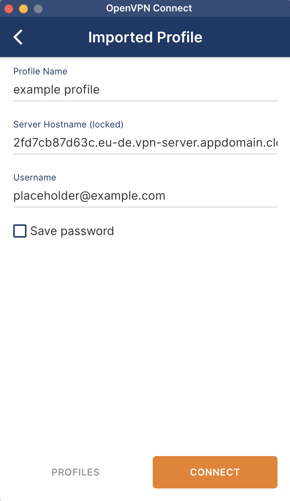
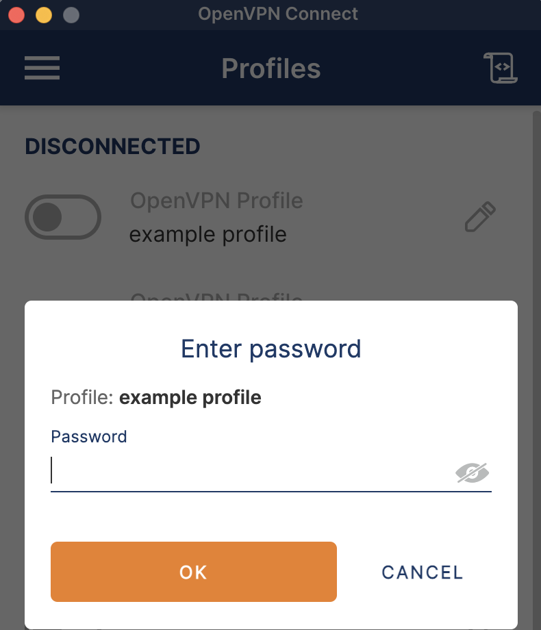
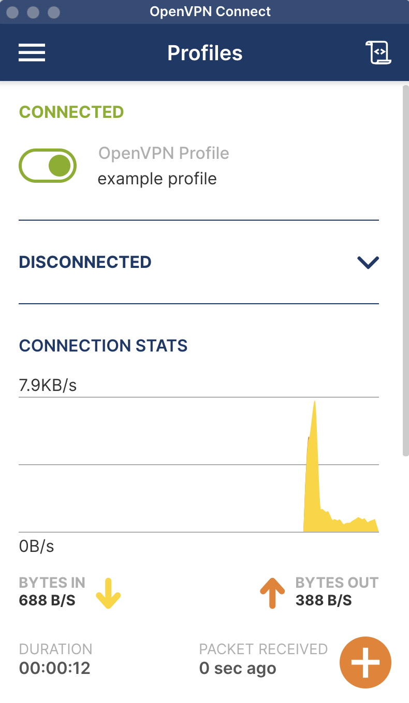
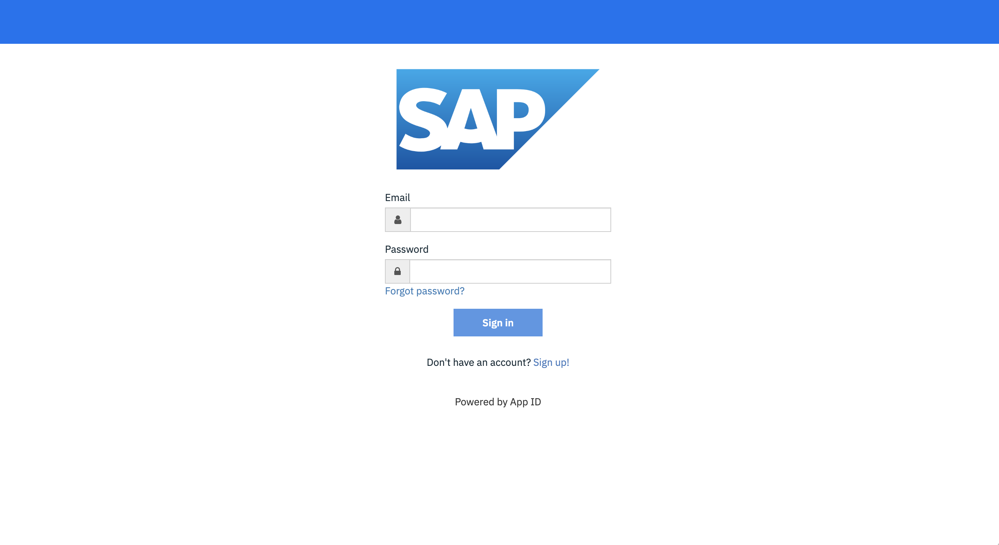

---
copyright:
  years: 2024
lastupdated: "2024-07-12"

subcollection: sap-ase-managed
---

{{site.data.keyword.attribute-definition-list}}

# Connecting to the Cloud ASE Portal
{: #connect}

The Cloud ASE Portal provides customers with the ability to

- upload and manage database encryption keys
- restart ASE database servers
- execute ad-hoc back-ups and restores
- drop databases
- view important ASE config files 

VPN access and initial credentials must be retrieved in order to connect to the Cloud ASE Portal.

Be sure to accept the invitation to the IBM Cloud account. An IBMid is required to succesfully connect.

## Configure VPN Access
{: #configure-vpn-access}

The Cloud ASE Portal is deployed on a private network. To access the portal, VPN access must be configured.

1. Login to IBM Cloud
2. Go to the Resource List and launch the Secrets Manager instance.
3. Select "View Secret" for the `$PREFIX-vpn-server-config` under the `$PREFIX-ssp-access-secret-group` secret group.
4. Download the Client Profile.
5. Install and open [OpenVPN](https://openvpn.net/) connect.
6. Unzip the downloaded Client Profile and locate the OVPN file.
7. Add a Profile and upload the OVPN file.
  {: caption="Import Profile into OpenVPN Connect Tool" caption-side="bottom"}
8. Specify your IBM Cloud username in the username field.
  {: caption="Configure VPN Profile in OpenVPN Connect Tool" caption-side="bottom"}
9. Click "Connect"
10. When prompted to "Enter password", retrieve [a one time passcode from IBM Cloud](https://iam.cloud.ibm.com/identity/passcode). If prompted to login, enter your IBM Cloud email and password. If necessary, complete MFA requirements when prompted.
  {: caption="Obtain MFA Password to connect to VPN Profile" caption-side="bottom"}
11. Upon successful connection, the toggle will be enabled next to the configured profile.

{: caption="Connected to VPN" caption-side="bottom"}

For future connections, click the toggle next to the desired Profile to connect. {: tip}

## Login to the Cloud ASE Portal 
{: #login-to-the-cloud-ase-portal}

1. Login to IBM Cloud.
2. Go to the Resource List and launch the Secrets Manager instance.
3. Select "View Secret" for the `$PREFIX-dba-initial-login` secret under the `$PREFIX-ssp-access-secret-group` secret group.
4. Confirm you are in a safe environment and copy the secret value.
5. Launch your desired internet browser and navigate to the Cloud ASE Portal.
  {: caption="Login to Cloud ASE Portal" caption-side="bottom"}
  If you are unable to connect, verify that you have configured VPN access before continuing. VPN access is required to access the Cloud ASE Portal. {: tip}
6. Login with your IBM Cloud email and initial password from Secets Manager.
It is strongly recommended that the initial password be updated. To update, click "Forgot Password" on the portal's Login page.
{: tip}

## Manage Cloud ASE Portal Users
{: #manage-users}

The Self Service Portal is integrated with [IBM Cloud App ID](https://www.ibm.com/products/app-id). With Cloud Directory, you can manage your users in a scalable registry by using pre-built functionality that enhances security and self-service. See the IBM Cloud App ID documentation for [Managing users](https://cloud.ibm.com/docs/appid?topic=appid-cd-users) in Cloud Directory.
