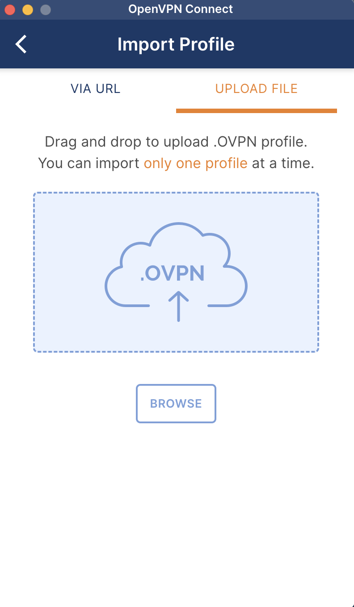
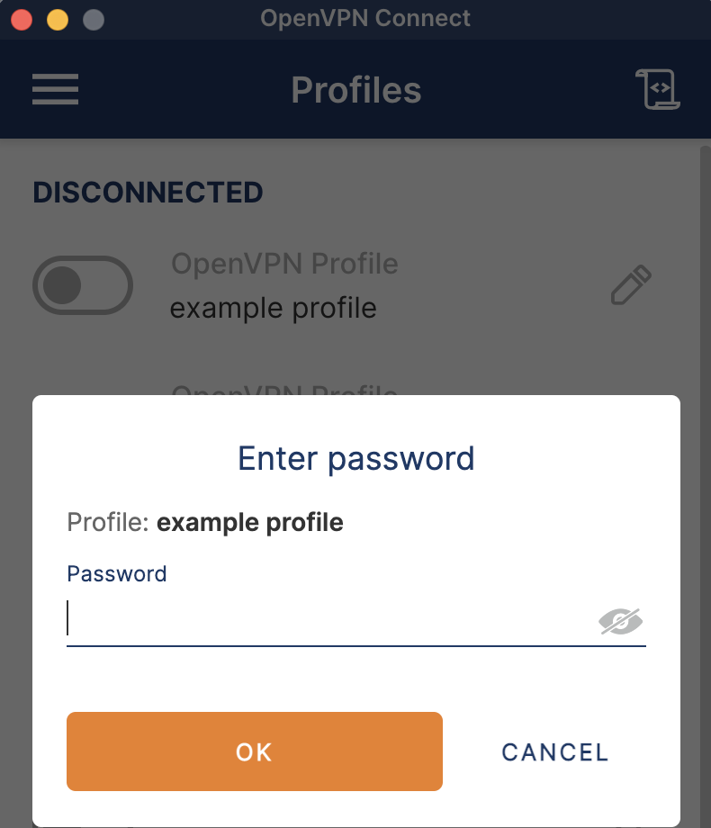
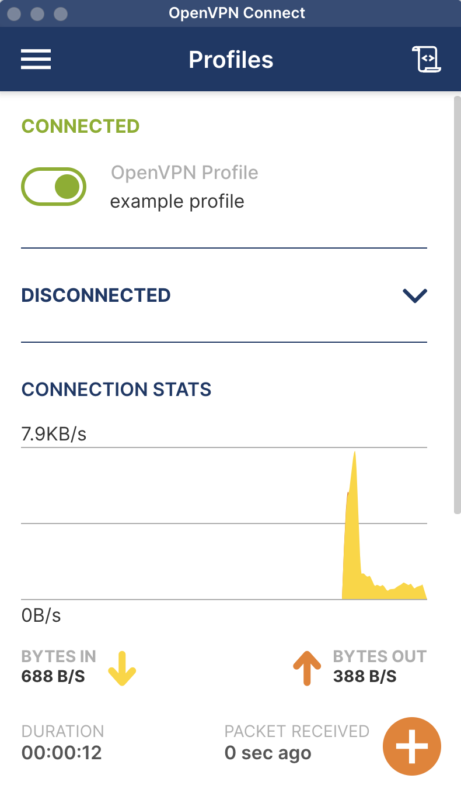
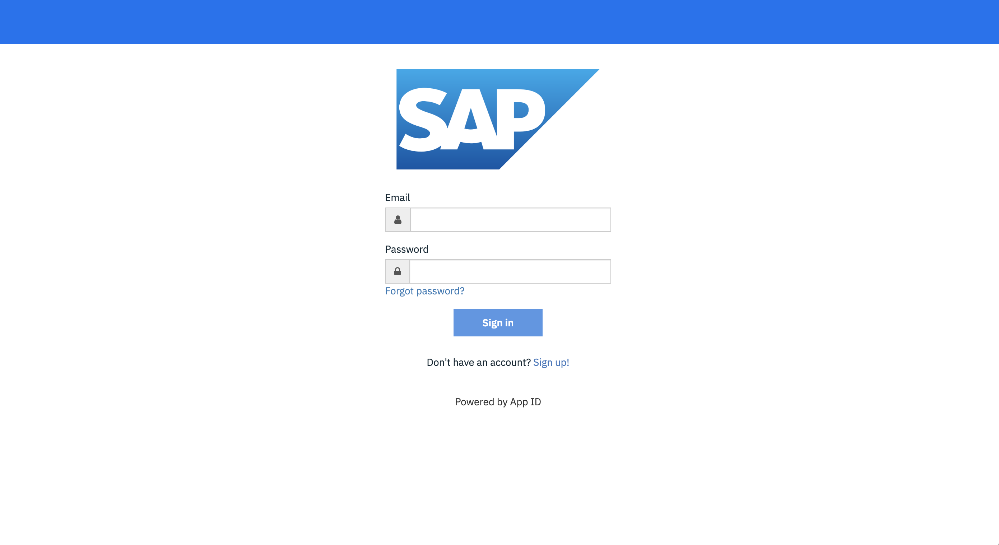

---
copyright:
  years: 2024
lastupdated: "2024-07-12"

subcollection: sap-ase-managed
---

{{site.data.keyword.attribute-definition-list}}

# Connecting to the Cloud ASE Portal
{: #connect-ase-portal}

The Cloud ASE Portal provides customers with the ability to

- upload and manage database encryption keys
- restart ASE database servers
- execute ad-hoc back-ups and restores
- drop databases
- view important ASE config files 

VPN access and initial credentials must be retrieved in order to connect to the Cloud ASE Portal.

Be sure to accept the invitation to the IBM Cloud account. An IBMid is required to succesfully connect.
{: tip}

## Configure VPN Access
{: #configure-vpn-access}

The Cloud ASE Portal is deployed on a private network. To access the portal, VPN access must be configured.

1. Login to IBM Cloud
2. Go to the Resource List and launch the Secrets Manager instance.
3. Select "View Secret" for the `<% base environment prefix %>-vpn-server-config` under the `<% base environment prefix %>-ase-user-secrets` secret group. 
4. Confirm you are in a safe environment and copy the secret value.
5. Create a OVPN file locally (e.g., `vpn.ovpn`) and paste the contents of the secret into the new file.
6. Install and open [OpenVPN Connect](https://openvpn.net/).
7. Add a Profile and upload the OVPN file.
    {: caption="Import Profile into OpenVPN Connect Tool" caption-side="bottom"}
8. Specify your IBM Cloud username in the username field.
    {: caption="Configure VPN Profile in OpenVPN Connect Tool" caption-side="bottom"}
9. Click "Connect"
10. When prompted to "Enter password", retrieve [a temporary one time passcode from IBM Cloud](https://iam.cloud.ibm.com/identity/passcode). If prompted to login, enter your IBM Cloud email and password. If necessary, complete MFA requirements when prompted.
    {: caption="Obtain MFA Password to connect to VPN Profile" caption-side="bottom"}
11. Upon successful connection, the toggle will be enabled next to the configured profile.
    {: caption="Connected to VPN" caption-side="bottom"}

    For future connections, click the toggle next to the desired Profile to connect. 
    {: tip}

## Manage Cloud ASE Portal Users
{: #manage-users}

The Cloud ASE Portal is integrated with [IBM Cloud App ID](https://www.ibm.com/products/app-id). 

Users must be registered in IBM Cloud App ID's Cloud Directory to access the Portal. With Cloud Directory, you can manage your users in a scalable registry by using pre-built functionality that enhances security and self-service. 

See the IBM Cloud App ID documentation for [Managing users](https://cloud.ibm.com/docs/appid?topic=appid-cd-users) in Cloud Directory.

## Login to the Cloud ASE Portal 
{: #login-to-the-cloud-ase-portal}

1. Login to IBM Cloud.
2. Go to the Resource List and launch the Secrets Manager instance.
3. Select "View Secret" for the `<% base environment prefix %>-dba-initial-login` secret under the `<% base environment prefix %>-ase-user-secrets` secret group.
4. Confirm you are in a safe environment and copy the secret value.
5. Launch your desired internet browser and navigate to the Cloud ASE Portal.
    {: caption="Login to Cloud ASE Portal" caption-side="bottom"}

    If you are unable to connect, verify that you have configured VPN access and are added to IBM Cloud App ID's Cloud Directory before continuing. Both are required to access the Cloud ASE Portal. 
    {: tip}

6. Login with your IBM Cloud email and initial password from Secets Manager.

    It is strongly recommended that the initial password be updated. To update, click "Forgot Password" on the portal's Login page. 
    {: tip}
